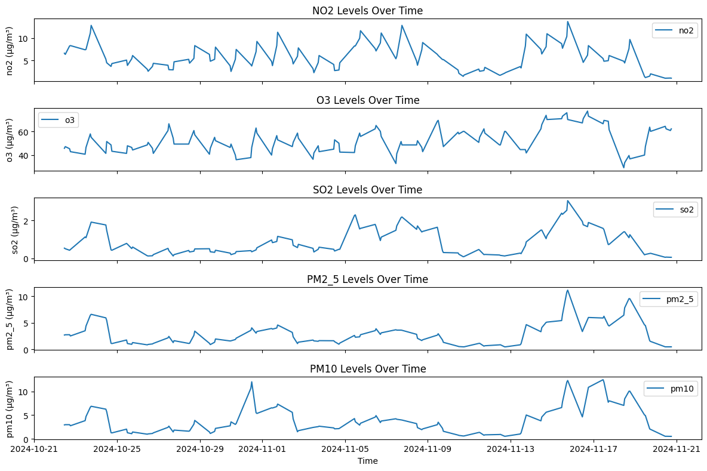
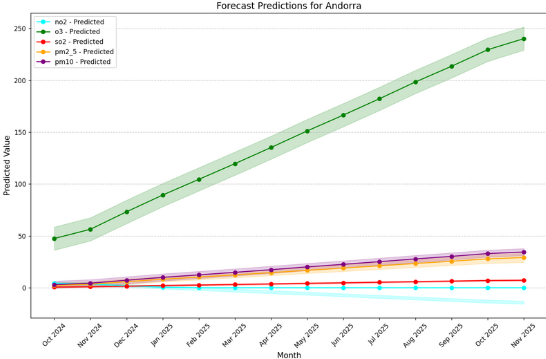
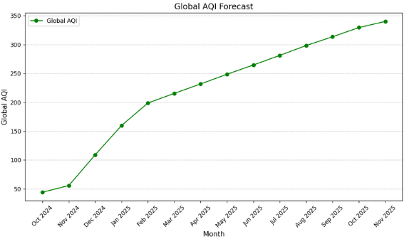

# Air Polluants & Air Quality Index (AQI) Forecasting

## Project Overview
This project aims to predict the Air Polluants and the global Air Quality Index (AQI) of a given country based on historical pollutant data. Using time-series forecasting model, this project estimate AQI values for multiple pollutants and derive an overall global AQI for a given country. The forecasting model relies on Facebook's Prophet, a robust and widely used forecasting tool for time-series analysis.

## Repository Structure
```
├── src
│   ├── model.py              # Model training, saving, and prediction functions
│   ├── data_analysis.ipynb   # EDA
|   ├── data
│       ├── Air_quality_data_all_countries.csv # Preprocessed dataset containing historical air quality data
        ├── cleaned_dataset.csv # Processed dataset containing historical air quality data
├── models                   # Saved trained Prophet models, will be created after running the main.py
├── results                  # Generated AQI forecast results for a given country saved on a csv format
├── main.py                  # Main script for running the forecasting pipeline
├── utils.py              # Helper functions for AQI calculation and visualization
├── README.md                 # Project documentation
├── requirements.txt          # Project libraries   
```

## How to Run the Project
1. Install the required dependencies:
   ```bash
   pip install -r requirements.txt
   ```
2. Run the main script:
   ```bash
   python main.py
   ```
3. Enter the desired country when prompted.
4. The script will:
   - Train models for NO2, O3, SO2, PM2.5, and PM10 pollutants.
   - Load saved models if available.
   - Forecast pollutant levels for the next 356 days.
   - Compute monthly AQI values and save results.
   - Calculate the global AQI for each month.
   - Generate and display forecast plots.

## Data Source & Exploratory Data Analysis (EDA)
### Data Source
The original dataset (Air_quality_data_all_countries.csv) contains air pollution measurements from various countries. It consists of 5,400 rows and includes pollutant levels recorded over time, with key columns:
- `timestamp`: Date of the recorded measurement.
- `country`: The country where the data was collected.
- `co`, `no`, `nh3`, `no2`, `o3`, `so2`, `pm2_5`, `pm10`: Pollutant concentrations.
- `AQI`: Global Air Quality Index (AQI).

Later, after a data analysis and cleaning, the The dataset (cleaned_dataset.csv) was saved and used to train the model.

### Exploratory Data Analysis
EDA was performed to:
- Identify missing values and perform necessary imputations.
- Analyze pollutant trends over time.
- Understand seasonal variations in AQI.
- Visualize correlation among pollutants.

The following general informations were extracted from the EDA:
- Data contains 45 unique countries, each with 120 recorded entries.
- The first recorded timestamp is 2024-10-21, and the last is 2024-11-21.
- NO₂ data showed an IQR-based outlier detection, leading to 714 detected outliers.
- Those Outliers were replaced with the mean value and any negative predictions were set to 0.



## Models Used & Justification
Facebook Prophet was used for time-series forecasting due to:
- Its ability to handle missing data effectively.
- Incorporation of seasonal patterns and holiday effects.
- Robust handling of outliers.
- Automatic trend and seasonality detection.

Each pollutant is modeled separately using Prophet, and the results are aggregated to compute the overall AQI.

## Results
- **Individual Pollutant Forecasts:**
  - Forecasts for a given country and for each pollutant are performed and are stored in the `results` directory under the name `country_pollutant_monthly_forecast_aqi.csv`.
- **Global AQI Calculation:**
  - The highest AQI across all pollutants is selected as the monthly global AQI and stored in the `results` directory under the name `country_glbal_monthly_aqi.csv`.
- **Visualizations:**
  - Forecast plots are generated for individual pollutants.
  - A global AQI trend plot is provided for the given country.

The final output helps in understanding pollution trends and making informed decisions regarding air quality management.

## Results
For example, let's predict the values of pollutants and AQI for `Andorra`. Here are the results for the predictions of the pollutants concentration, as well as the value of the global AQI for each month from October 2024 to November 2025.




## Future Improvements
- Integration of additional environmental factors (temperature, humidity, wind speed).
- Developement and deployment of an application for real-time forecasting.
- Incorporation of deep learning models for enhanced accuracy.
---
This project provides a comprehensive AQI forecasting solution, offering insights into air quality trends. It is also part of another project called `AWS-Real-time-Air-Quality-Visualization-and-prediction-and-LLM-reporting`. You can check out the related project [here](https://github.com/cyrineanene/AWS-Real-time-Air-Quality-Visualization-and-prediction-and-LLM-reporting).
